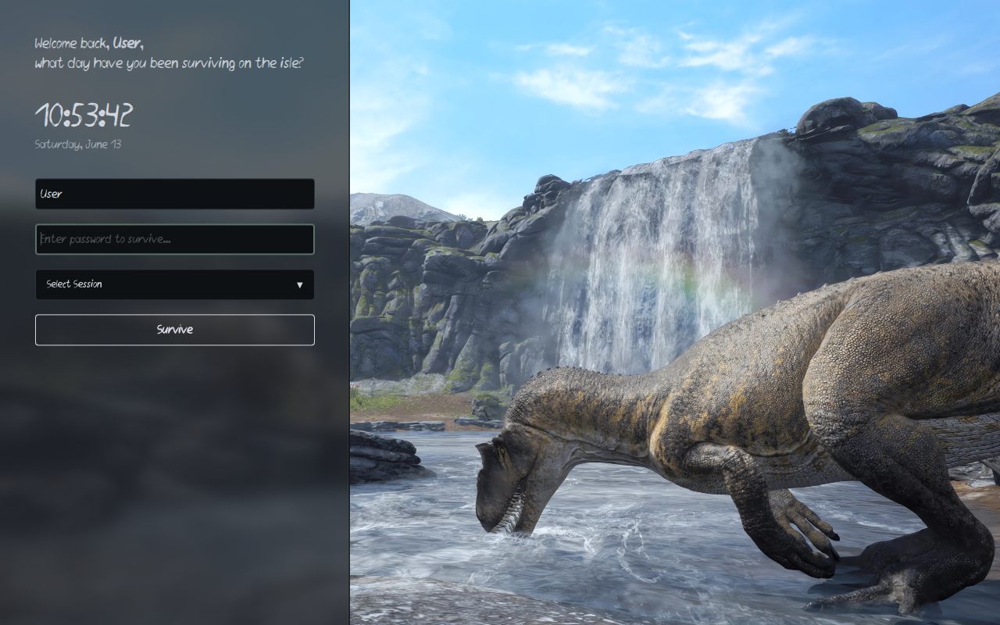

# On the Waterfall SDDM Theme 🦖🌊

Language: [English](README.md) | [Русский](README_RU.md)

A dark, atmospheric survival-inspired login theme for SDDM, styled after the aesthetics of **The Isle (Legacy)**. It features a sharp, responsive layout, a native high-performance blurred left sidebar, and a tailored color palette extracted from misty rocks and raw wilderness scenery.

Designed to make you feel the tension of prehistoric survival every time you boot up your Linux system.

---

## ✨ Features

- 🎭 **The Isle Aesthetic:** A cold, gritty palette of deep rocky greys and mossy green accents.
- 🧪 **Native Qt6 Glassmorphism:** High-performance sidebar blur utilizing `Qt5Compat.GraphicalEffects` without distorting the background.
- 🎛️ **Custom Session Dropdown:** Fully customized, zero-bug overlay menu for selecting Window Managers or Desktop Environments (Hyprland, Plasma, Sway, etc.).
- 🖋️ **Custom Typography:** Integrated `Daneehand Regular` typography across all interfaces.
- 🕒 **Survival Clock:** Real-time ticking clock with a localized date indicator.
- 👤 **Smart Username Fallback:** Remembers the last logged-in user or gracefully falls back to a default profile.

---

## 📸 Preview



---

## 📂 Installation

### 1. Manual Installation

Clone this repository or download the ZIP archive and copy the folder directly into your system's SDDM themes directory:

```bash
# Clone the repository
git clone https://github.com/neverloseagain1/After-The-Waltz-SDDM-Theme

# Move the theme directory to system SDDM themes folder with the correct name
sudo cp -r The-Isle-SDDM /usr/share/sddm/themes/On-The-Waterfall
```

### 2. Enable the Theme

Edit your system's SDDM configuration file (usually found at `/etc/sddm.conf` or `/etc/sddm.conf.d/theme.conf`). Set the current theme under the `[Theme]` section:

```ini
[Theme]
Current=On-The-Waterfall
```

---

## ⚙️ Configuration

You can easily tweak colors, fonts, and backgrounds by editing the `theme.conf` file inside the theme directory:

```ini
[General]
# Color palette in HEX format (Misty rocks & Wilderness)
ColorLight="#D2D7DF"
ColorDark="#1B1E22"
ColorAccent="#5C6F65"
ColorInputBg="#0E1113"

# Font configurations
Font="daneehandregular"
FontSize="20"

# Path to your background image
Background="backgrounds/background.jpg"
```

---

## 🛠️ Testing Without Reboot

You can preview and test how the theme looks live on your screen without logging out by running the following command in your terminal:

```bash
sddm-greeter-qt6 --test-mode --theme /usr/share/sddm/themes/On-The-Waterfall
```

---

## 📜 Dependencies

Ensure your Linux distribution has the required graphical effects layer installed for the native blur to work on Qt6:
- For **Arch Linux**: `sudo pacman -S qt6-5compat`
- For **Ubuntu/Debian**: `sudo apt install qml6-module-qt5compat-graphicaleffects`
- For **Fedora**: `sudo dnf install qt6-qt5compat`
